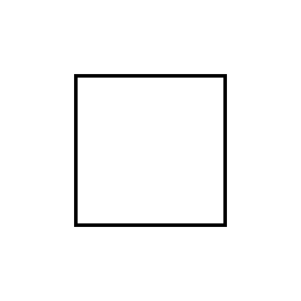

# quad-bench

Asks vision models whether a square is a square, rectangle, parallelogram, rhombus, kite, all of the above, or none of the above.

A square is all five shapes, so the expected answer is `f`. The rotated image tests whether a model mistakes a tilted square for only a rhombus.

Inspired by Vsauce's short [I 🟥 Quadrilaterals](https://www.youtube.com/shorts/asTywgpiSkQ).

## The question



Look at the shape in the image. Which of the following is it?

- [ ] a) square
- [ ] b) rectangle
- [ ] c) parallelogram
- [ ] d) rhombus
- [ ] e) kite
- [ ] f) all of the above
- [ ] g) none of the above

## Run

```sh
cp .env.sample .env                                  # fill in keys
uv run --env-file .env jev.py                        # Jev is text-only, so the shape is described in text
```

## Results (2026-09-28, 3 runs each, about $0.67)

| model                         | square.png  | square_rotated45.png |
| ----------------------------- | ----------- | -------------------- |
| anthropic/claude-opus-5.5     | fx3         | fx3                  |
| anthropic/claude-fable-5.1    | fx3         | fx3                  |
| openai/gpt-6-sol              | fx3         | fx3                  |
| openai/gpt-6-luna             | fx3         | fx3                  |
| google/gemini-3.1-pro-preview | fx3         | fx3                  |
| google/gemini-3.8-flash       | fx3         | fx3                  |
| x-ai/grok-4.7                 | fx3         | fx3                  |
| qwen/qwen3.8-27b              | fx3         | fx3                  |
| mistralai/mistral-medium-3-5  | fx3         | dx3                  |
| moonshotai/kimi-k3            | fx3         | fx3                  |
| z-ai/glm-5v-turbo             | fx3         | fx3                  |
| typesafe/jev-router           | fx3         | fx3                  |

`typesafe/jev-router` routes to other models, so its answers are not Jev's own.
